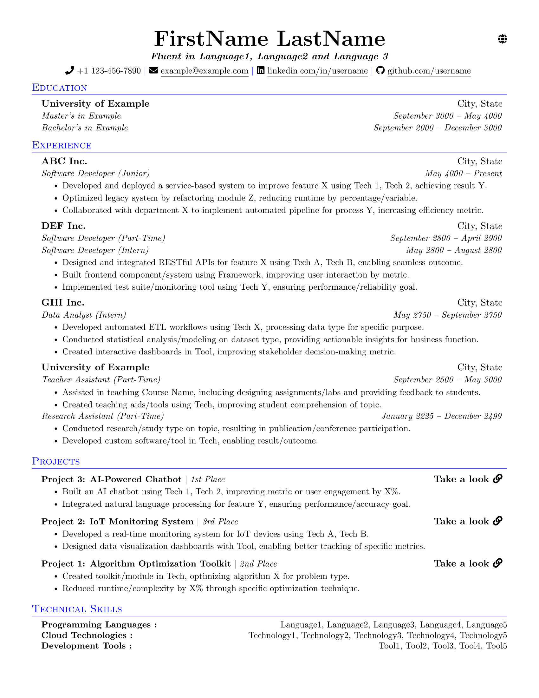

# 📝 Tech Resume Template  

  

## 🚀 Overview  

This is a great single-page, single-column **resume template** for tech professionals, designed with efficiency, clarity, and customization in mind. Whether you're a software engineer, data scientist, or computer engineer, this LaTeX-based resume format helps you showcase your **education**, **experience**, **projects**, and **skills** in a concise yet impactful way.  

### Why Choose This Template?  
- **Optimized Design**: A single-column layout ensures readability and a professional appearance.  
- **Tailored for Tech**: Sections are structured to highlight achievements, technical skills, and project impact.  
- **Customizable**: Built with clearly documented commands for easy editing and consistent formatting.  
- **Compact and ATS-Friendly**: Fits all critical information on a single page while maintaining compatibility with Applicant Tracking Systems (ATS).  

---

## 📂 Template Features  

### Sections Included  
1. **Education**: Clearly document your academic background and achievements.  
2. **Experience**: Highlight professional roles, responsibilities, and key accomplishments.  
3. **Projects**: Showcase impactful projects, tech stacks used, and outcomes.  
4. **Skills**: List your technical proficiencies concisely (optional, but recommended).  

### Design Highlights  
- **Modern One-Column Layout**: Maximizes use of space and readability.  
- **Custom LaTeX Commands**: Ensures uniform formatting across sections.  
- **Well-Commented Code**: Makes customization quick and intuitive, even for LaTeX beginners.  

---

## 📋 How to Use  

### Option 2: Clone the repository  

1. **Clone the Repository**:  
   ```bash  
   git clone https://github.com/o-benz/Tech-Resume-Template.git  
   cd Tech-Resume-Template
   ```  

2. **Edit the Template**:  
   - Open the `main.tex` file in your preferred LaTeX editor (e.g., Overleaf, VS Code with LaTeX Workshop).  
   - Replace placeholders with your information:  
     - `\name{Your Name}`  
     - `\email{your.email@example.com}`  
     - `\linkedin{linkedin.com/in/yourprofile}`  
     - Update each section with your details.  

3. **Compile the Resume**:  
   - Use a LaTeX compiler (e.g., pdflatex, xelatex, or Overleaf) to generate the PDF.  

4. **Preview and Export**:  
   - The compiled `.pdf` is your ready-to-use resume!  

### Option 2: Use Overleaf  
1. Simply click this link to open the template on Overleaf: [Perfect Tech Resume Template on Overleaf](https://www.overleaf.com/gallery).
2. Create a copy of the project to your Overleaf account.  
3. Edit and compile the resume directly in your browser, no installation needed.  

---

## 💡 Tips for Optimization  

- **Be Specific**: Use metrics and outcomes wherever possible (e.g., "Improved API response time by 30%").  
- **Tailor for Roles**: Customize your resume for each application by rearranging or emphasizing relevant sections.  
- **Keep It Concise**: Stick to one page by prioritizing your most impactful achievements.  

---

## 🤝 Contributing  

Have suggestions or want to add new features? Feel free to submit an issue or pull request. Contributions are always welcome!  

---

## 🌟 Support the Project  

If you find this template useful, please consider:  
- **Starring this repository**: If you like this project, please give it a ⭐ to help others discover it.  
- **Following me on GitHub**: for updates on this and other projects.  

Your support helps in maintaining and improving the project!  

---

## 📄 License  

This project is licensed under the [MIT License](LICENSE), so feel free to use, modify, and share it as you like.  

---  

**Elevate your tech career with a resume that truly stands out!**  